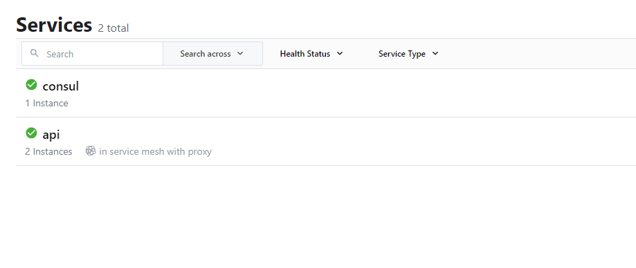
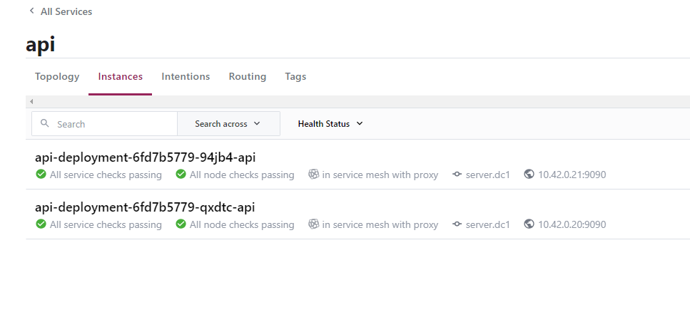

To enable a Kubernetes deployment or pod to be part of the Consul service mesh you only need to add a single annotation to the 
pod specification.

```yaml
"consul.hashicorp.com/connect-inject": "true"
```

Consul uses a mutating webhook that is listening for new pods and deployments, when it finds one that has the previous annotation it will
automatically add the data plane components and register the application with the service mesh.

The full configuration looks like the below, as you can see other than the annotation this is a completely normal Kubernetes deployment.

```yaml
---
# API service version 1
apiVersion: apps/v1
kind: Deployment
metadata:
  name: payments
  labels:
    app: payments
spec:
  replicas: 3
  # Ensure rolling deploys
  selector:
    matchLabels:
      app: payments
  template:
    metadata:
      labels:
        app: payments
        group: payments
      annotations:
        "consul.hashicorp.com/connect-inject": "true"
        "consul.hashicorp.com/service-tags": "v1"
    spec:
      containers:
      - name: payments
        image: nicholasjackson/fake-service:v0.20.0
        ports:
        - containerPort: 9090
        env:
        - name: "LISTEN_ADDR"
          value: "127.0.0.1:9090"
        - name: "NAME"
          value: "api"
        - name: "MESSAGE"
          value: "Response from API"
```

Copy the following command into the terminal below and press enter.

```shell
kubectl apply -f ./api_1.yaml
```

<p>
<Terminal target="tools.container.shipyard.run" shell="/bin/bash" workdir="/files" user="root" expanded />
</p>

If you query kubernetes for pods in the `app` namespace you should see something like the following.

```shell
kubectl get pods -n app
```

```shell
NAME                             READY   STATUS    RESTARTS   AGE
api-deployment-6fd7b5779-94jb4   3/3     Running   0          23s
api-deployment-6fd7b5779-qxdtc   3/3     Running   0          23s
```

Looking in the Consul UI, [http://localhost:8500](http://localhost:8500), you will also see the new service `api`.



And by clicking on the service `api` and then the `instances` tab you will be able to see the two registered pods.



If you take a closer look at the output from earlier you will see that there were three containers listed for the pod.

```shell
NAME                             READY   STATUS    RESTARTS   AGE
api-deployment-6fd7b5779-94jb4   3/3     Running   0          23s
api-deployment-6fd7b5779-qxdtc   3/3     Running   0          23s
```

However in the pod spec there is only one container defined.

```yaml
    spec:
      containers:
      - name: payments
        image: nicholasjackson/fake-service:v0.20.0
        ports:
        - containerPort: 9090
```

When you submitted the application to Kubernetes, Consul's mutating webhook controller has automatically added two other containers.
The Envoy proxy, and a lifecycle container that manages the registration to Consul service mesh's service catalog. 

Let's now see how you can add a second application and get them to communicate using the service mesh.

## Deploying the Payments service

Adding a second service is exactly the same as the steps you performed previously, you are going to create the following Kubernetes
deployment. 

```yaml
---
apiVersion: apps/v1
kind: Deployment
metadata:
  name: payments
  labels:
    app: payments
spec:
  replicas: 2
  selector:
    matchLabels:
      app: payments
  template:
    metadata:
      labels:
        app: payments
        metrics: enabled
      annotations:
        "consul.hashicorp.com/connect-inject": "true"
    spec:
      containers:
      - name: payments
        image: nicholasjackson/fake-service:v0.20.0
        ports:
        - containerPort: 9090
        env:
        - name: "LISTEN_ADDR"
          value: "127.0.0.1:9090"
        - name: "NAME"
          value: "api"
        - name: "MESSAGE"
          value: "Response from Payments"
```

Run the following command in the terminal below:

```shell
kubectl apply -f ./payments_1.yaml
```

<p>
<Terminal target="tools.container.shipyard.run" shell="/bin/bash" workdir="/files" user="root" expanded />
</p>

If you query kubernetes for pods in the `app` namespace you should see something like the following.

```shell
kubectl get pods -n app
```

```shell
NAME                             READY   STATUS    RESTARTS   AGE
api-deployment-6fd7b5779-94jb4   3/3     Running   0          55m
api-deployment-6fd7b5779-qxdtc   3/3     Running   0          55m
payments-7f9dc48f88-29pnq        3/3     Running   0          4s
payments-7f9dc48f88-4rcfh        3/3     Running   0          4s
```

Looking in the Consul UI, [http://localhost:8500](http://localhost:8500), you will also see the new service `payments`.

Now you have both services deployed, let's see how you can enable communication using the service mesh.