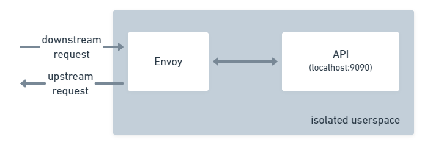
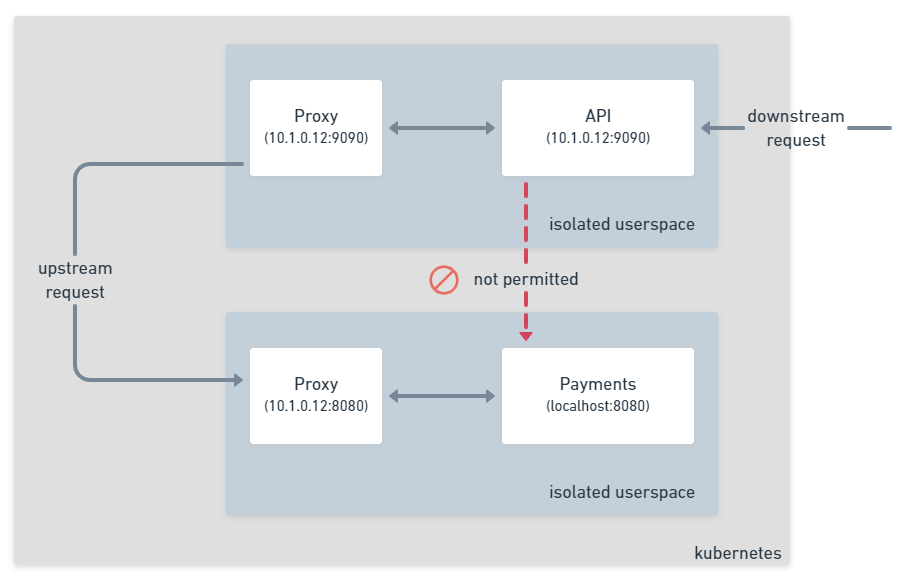

This example shows how you can configure two services to communicate using TCP in Consul Service Mesh
on Kubernetes.

The following components have already been installed and configured for you:

* [Consul Service Mesh](http://localhost:8500)
* [Grafana](http://localhost:8080) - **User:** admin **Pass:** admin
* Prometheus
* Loki

## How traffic flows in the Service Mesh

Unlike a conventional Kubernetes setup where traffic flows directly between containers in a Pod the service mesh routes
traffic through a proxy or the data plane.

The proxy manages all of the heavy lifting for the application: 
* Securing the transport using TLS. 
* Ensuring that only allowed traffic is allowed to pass to the destination service.
* Managing service discovery and loadbalancing for upstream calls to other services.
* Handling network reliability with configurable, retries, timeouts, and circuit breaking.
* Collecting and exposing network level metrics such as the number of connections, requests,
bytes transferred, and much more.

## Example application

The example application you will deploy is a simple two service application consisting of an API and a Payments service.
Both applications are RESTful services that use JSON to communicate.

In the next section you will learn how to add services to Consul.