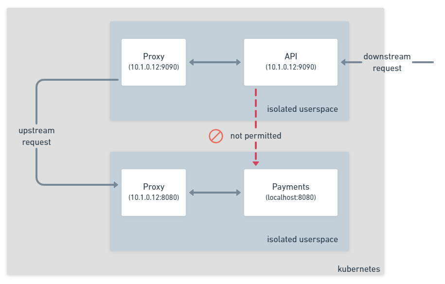

To enable two services on the service mesh to communicate you need to add an additional annotation to the downstream service.
In your use case the API service needs to communicate with the Payments service as shown in the following diagram.



To enable this you need to add an additional annotation `consul.hashicorp.com/connect-service-upstreams`, this is a comma separated
list of all the upstream services you would like to make available to the application and the port they will be accessible on.

For example to make the payments service available at `localhost:9091`, you would use the following annotation.

```yaml
"consul.hashicorp.com/connect-service-upstreams": "payments:9091"
```

In Consul version `1.10` this behavior will change exposing a kubernetes service instead of localhost, this will bring the
functionality closer to the Kubernetes standard.

Let's modify the previous `api` deployment to add the new annotation, the new deployment looks like the following example.


```yaml
---
# Web frontend
apiVersion: apps/v1
kind: Deployment
metadata:
  name: api-deployment
  namespace: app
  labels:
    app: api
spec:
  replicas: 2
  selector:
    matchLabels:
      app: api
  template:
    metadata:
      labels:
        app: api
        metrics: enabled
      annotations:
        "consul.hashicorp.com/connect-inject": "true"
        "consul.hashicorp.com/connect-service-upstreams": "payments:9091"
    spec:
      containers:
      - name: api
        image: nicholasjackson/fake-service:v0.20.0
        ports:
        - containerPort: 9090
        env:
        - name: "LISTEN_ADDR"
          value: "0.0.0.0:9090"
        - name: "UPSTREAM_URIS"
          value: "http://localhost:9091"
        - name: "NAME"
          value: "api"
        - name: "MESSAGE"
          value: "Hello World"
```

You can apply the config by running the following command in the terminal below:

```shell
kubectl apply -f ./api_2.yaml
```

<p>
<Terminal target="tools.container.shipyard.run" shell="/bin/bash" workdir="/files" user="root" expanded />
</p>

## Testing the application

Let's test that the application is working. Both of the example applications you have been using during this
tutorial are an application called `fake-service`. `fake-service` allows you to simulate a JSON or gRPC
application without needing to write any code. You can configure behaviours in fake service such as the 
upstream requests it will make. 

The configuration for the upstreams is managed by the environment variable `UPSTREAM_URIS` this takes a comma
separated list of URIs that will be called everytime you call the main application. If you look at this 
configuration for the API you will see that this has been configured to `http://localhost:9091` which
thanks to the service mesh will resolve to the payments service.

```yaml
- name: "UPSTREAM_URIS"
  value: "http://localhost:9091"
```

You can test if this is working by running the following command in the terminal below:

```shell
kubectl exec -it \
  deploy/api-deployment \
  -n app \
  -c api \
  -- \
  curl http://localhost:9090
```

<p>
<Terminal target="tools.container.shipyard.run" shell="/bin/bash" workdir="/files" user="root" expanded />
</p>

There is no public ingress for the application so instead you are using the `curl` command from inside one of the API 
containers.

You should see the the following response:

```json
{
  "name": "api",
  "uri": "/",
  "type": "HTTP",
  "ip_addresses": [
    "10.42.0.28"
  ],
  "start_time": "2021-03-05T13:02:25.883996",
  "end_time": "2021-03-05T13:02:25.911616",
  "duration": "27.6194ms",
  "body": "Hello World",
  "upstream_calls": {
    "http://localhost:9091": {
      "name": "api",
      "uri": "http://localhost:9091",
      "type": "HTTP",
      "ip_addresses": [
        "10.42.0.25"
      ],
      "start_time": "2021-03-05T13:02:25.910674",
      "end_time": "2021-03-05T13:02:25.910909",
      "duration": "235.5µs",
      "headers": {
        "Content-Length": "261",
        "Content-Type": "text/plain; charset=utf-8",
        "Date": "Fri, 05 Mar 2021 13:02:25 GMT"
      },
      "body": "Response from Payments",
      "code": 200
    }
  },
  "code": 200
}
```

That completes this short tutorial, let's take a look at what you have learned.